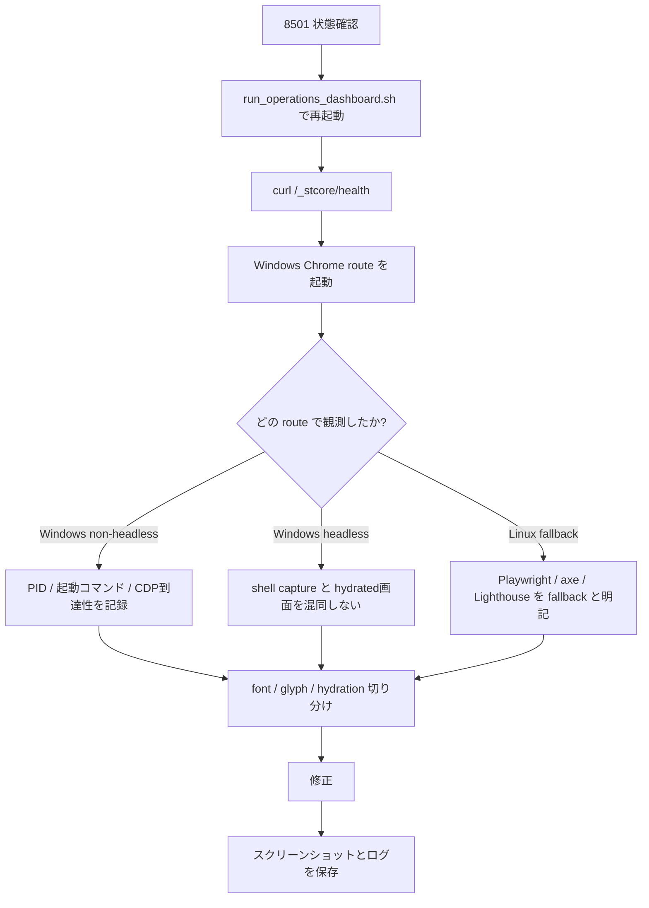
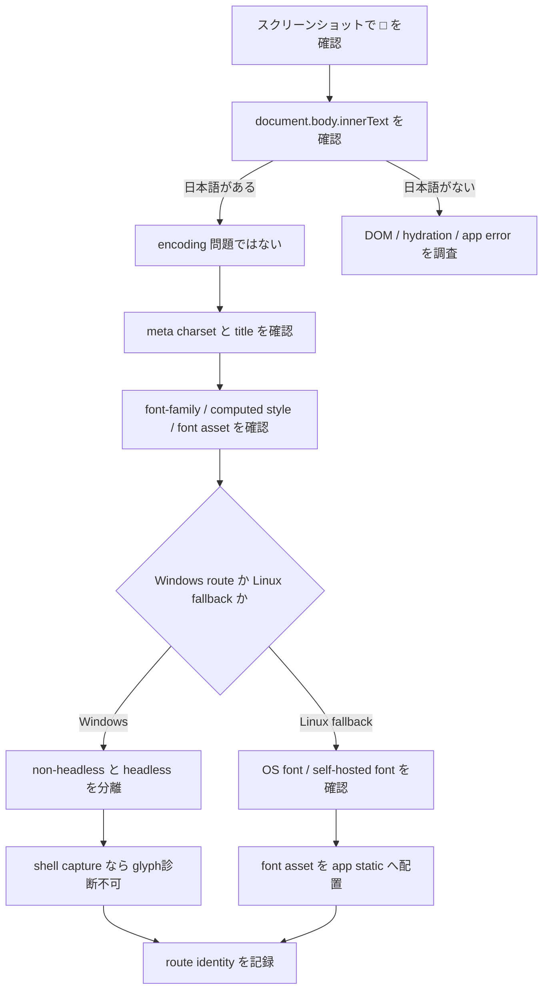
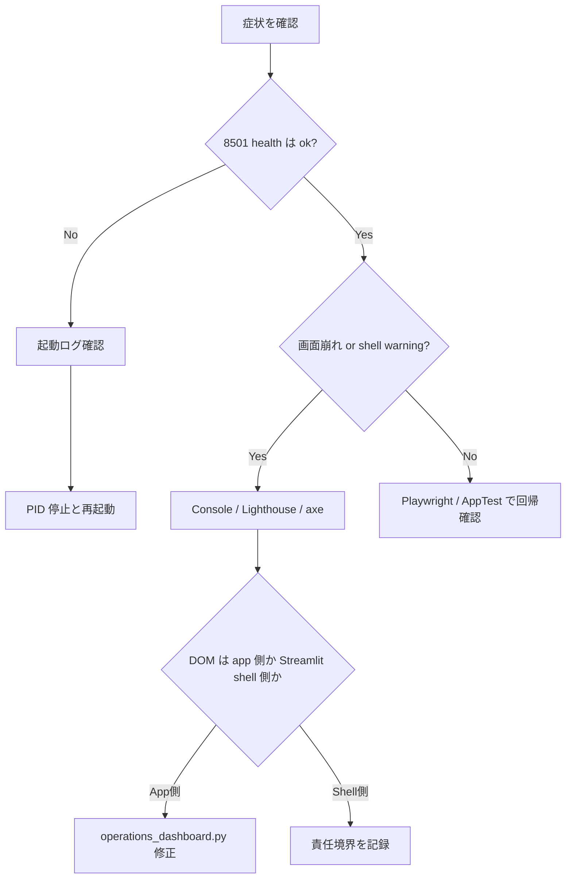

# Operations Dashboard Debug Runbook

対象アプリは `${PROJECT_ROOT}/src/loto_forecast/api/streamlit/operations_dashboard.py` です。起動入口は `${PROJECT_ROOT}/run_operations_dashboard.sh` を使います。

参考スクリーンショット:
- [Windows non-headless 診断画像](../artifacts/screenshots/10_windows_chrome_non_headless.png)
- [Windows headless shell capture](../artifacts/screenshots/11_windows_chrome_headless.png)
- [Linux fallback desktop after font fix](../artifacts/screenshots/12_linux_fallback.png)
- [Linux fallback mobile after font fix](../artifacts/screenshots/15_after_fix_mobile.png)

## 1. 再起動手順

1. プロセス確認
   `ps -ef | grep streamlit | grep -v grep`
2. 既存 PID を停止
   `kill <PID>`
3. 再起動
   `MPLCONFIGDIR=/tmp/matplotlib ${PROJECT_ROOT}/run_operations_dashboard.sh`
4. 疎通確認
   `curl -sS http://127.0.0.1:8501/_stcore/health`

判断基準:
- `ok` が返ること
- 8501 が単独で listen していること
- `artifacts/logs/restart_and_validation.log` に起動メッセージが残ること

## 2. 実行ブラウザの真正性確認

使用実体:
- `/mnt/c/Program Files/Google/Chrome/Application/chrome.exe`

確認項目:
1. 実行ファイルフルパス
2. 起動コマンド
3. PID
4. `userAgent`
5. `navigator.platform`
6. `headless / non-headless`
7. スクリーンショット取得経路
8. Lighthouse / axe / Playwright がどのブラウザだったか

今回の運用ルール:
- Windows non-headless:
  - 最低限 `ps -ef` で `chrome.exe` PID を残す
  - WSL から `9223` に到達できなければ「起動確認のみ、DOM未取得」と記録する
- Windows headless:
  - `--dump-dom --screenshot` は shell skeleton を拾うことがある
  - hydrated dashboard の証拠として扱わない
- Linux fallback:
  - Playwright / axe / Lighthouse は fallback と明記する
  - Windows Chrome の結果として報告しない

保存先:
- `artifacts/logs/browser_runtime_identity.md`
- `artifacts/logs/browser_runtime_identity.json`

## 3. 日本語 tofu 切り分け手順

見るべきポイント:
- HTTP レスポンス charset
- `<meta charset>`
- `document.body.innerText`
- `lang="ja"` の有無
- CSS `font-family`
- 実スクリーンショットが shell か hydrated か
- OS に日本語フォントがあるか
- self-hosted font を使っているか

## 4. 機械検査コマンド

Playwright 主要導線:
- `BASE_URL=http://127.0.0.1:8501 node tests/e2e/operations_dashboard_ui_check.mjs`

Streamlit AppTest:
- `pytest --no-cov -q tests/streamlit/test_operations_dashboard_apptest.py`

追加 UI helper test:
- `pytest --no-cov -q tests/unit/test_operations_dashboard_ui_helpers.py`

構文確認:
- `python -m py_compile src/loto_forecast/api/streamlit/operations_dashboard.py`

Lighthouse / DevTools:
- DevTools MCP `lighthouse_audit`

axe-core:
- Playwright から CDN 版 `axe.min.js` を注入し `artifacts/logs/axe_report.json` へ保存

## 5. 障害切り分け

判断基準:
- `section.stSidebar[aria-expanded]` のように Streamlit shell ノードなら framework 起因
- `document.head meta[name=description]` のようにアプリ管理可能な DOM なら app 起因
- root `/robots.txt` のように raw Streamlit が持たない配信面なら deployment/framework 起因
- DOM は正しいが画像だけ tofu なら font/glyph/runtime 起因
- Windows headless が shell だけなら hydration timing 起因

## 6. 今回の修正内容

- `src/loto_forecast/api/streamlit/static/fonts/NotoSansJP-VF.ttf` を追加
- `operations_dashboard.py` に self-hosted `@font-face` を追加
- app 全体の font stack を `OpsNotoSansJP` 優先に変更
- browser runtime identity ログを追加
- Windows と Linux fallback の route 分離ルールを明文化

## 7. よくある誤認パターン

- Windows `chrome.exe` が起動しただけで「Windows Chrome で画面確認できた」と書く
- Windows headless shell capture を hydrated dashboard の証拠に使う
- Linux Playwright / axe / Lighthouse の結果を Windows Chrome の結果として報告する
- DOM に日本語があるのに encoding 問題と決めつける
- `font-family` 文字列だけを見て glyph が解決していると誤認する

## 8. 今回の不具合一覧

- 修正済み
  - `meta-description`
  - `heading-order`
  - project tree の generated artifacts 露出
- 未解消
  - `aria-allowed-attr`
  - `button-name`
  - `color-contrast`
  - root `/robots.txt`
  - WSL -> Windows Chrome direct DevTools automation
  - Windows non-headless raster capture
  - Windows headless shell-only capture

## 9. 残課題

- root `/robots.txt` を本当に直すには reverse proxy または custom server route が必要
- Streamlit shell アクセシビリティ違反は upstream 依存
- Windows 側の live raster capture は依然として外部要因の影響が強い
- Linux fallback の tofu は self-hosted font で解消済み
