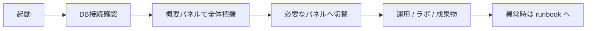
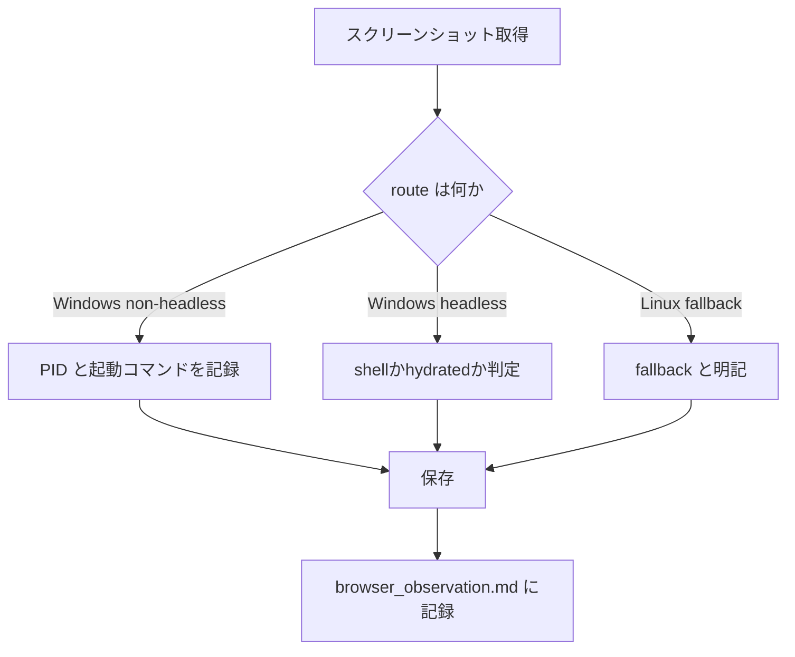
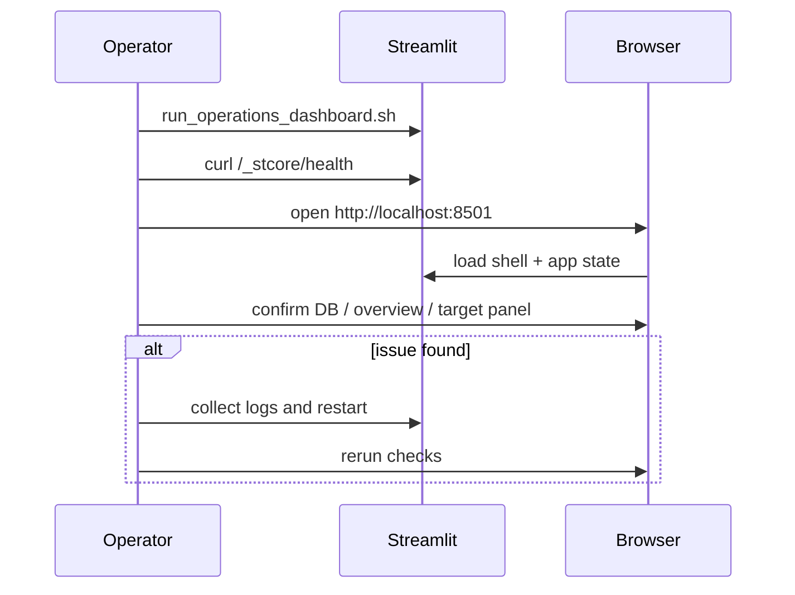
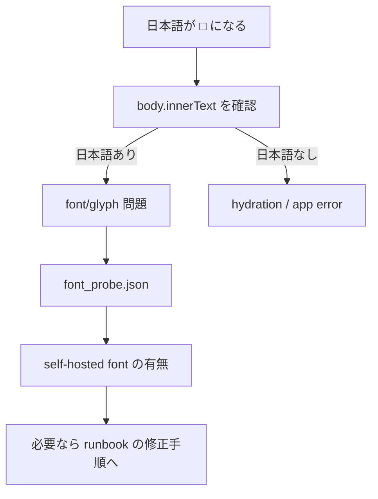

# Operations Dashboard Operation Manual

このダッシュボードは、ロト予測プロジェクトの DB 接続、実行状況、成果物、分析、補助ツールを 1 画面で確認するための運用 UI です。

参考画面:
- [Linux fallback desktop after font fix](../artifacts/screenshots/12_linux_fallback.png)
- [Linux fallback mobile after font fix](../artifacts/screenshots/15_after_fix_mobile.png)

## 1. 基本起動方法

1. `${PROJECT_ROOT}/run_operations_dashboard.sh` を実行
2. `curl -sS http://127.0.0.1:8501/_stcore/health` で `ok` を確認
3. 日常確認は Windows Chrome を優先して `http://localhost:8501` を開く

Windows Chrome 実体:
- `/mnt/c/Program Files/Google/Chrome/Application/chrome.exe`

重要:
- `chrome.exe` を起動しただけでは「Windows で確認済み」にはしない
- どの route で画面を見たかを `browser_observation.md` に残す

## 2. 主要画面説明

- サイドバー
  - DB 接続情報
  - 表示パネル切替
  - 表示/性能/ログ設定
- 概要
  - schema/table 数
  - 最新 `resources.run`
  - プロジェクト構造の簡易表示
- NeuralForecast 実行・検証ラボ
  - 学習、run_id 分析、リソース解析、DB 管理
- 運用
  - fallback tabs、Runner、モデル解析ラボ、実測 vs 予測

## 3. 入力欄の意味

- `ホスト`
  PostgreSQL の接続先
- `ポート`
  PostgreSQL ポート
- `ユーザー`
  DB 接続ユーザー
- `パスワード`
  画面保存はしない。空欄時は `DB_PASSWORD` を使う
- `データベース`
  接続する DB 名
- `一覧の上限行数`
  一覧取得件数の上限
- `サンプル表示行数`
  テーブル preview 件数の上限

## 4. 日常運用の確認項目

- 8501 health が `ok`
- DB 接続メッセージが成功表示
- `概要` の件数が急減していない
- `resources.run` の最新実行が異常終了していない
- Console に app 起因の error が増えていない
- H1 が `ロト予測 運用ダッシュボード` と読める
- サイドバーやメトリクスで日本語が tofu (`□`) になっていない

正常表示の判断基準:
- H1、日本語ラベル、概要カード名が読める
- `DB接続`、`概要`、`使い方クイックガイド` が日本語で見える
- モバイルでも H1 が画面内に収まる

## 5. 障害時の一次対応

1. health 確認
2. `artifacts/logs/restart_and_validation.log` を確認
3. 旧 Streamlit PID を停止
4. 再起動
5. [operations_dashboard_debug_runbook.md](./operations_dashboard_debug_runbook.md) の切り分けへ進む

豆腐文字が出たときの一次確認:
1. `browser_runtime_identity.md` を見て、Windows か Linux fallback かを確認
2. `font_diagnosis.md` を確認
3. `font_probe.json` と最新スクリーンショットを見る
4. shell capture ではなく hydrated screenshot かを確認

## 6. ログの場所

- 再起動/検証ログ
  `artifacts/logs/restart_and_validation.log`
- Lighthouse サマリ
  `artifacts/logs/lighthouse_report.txt`
- axe JSON
  `artifacts/logs/axe_report.json`
- 観測メモ
  `artifacts/logs/browser_observation.md`
- バグ一覧
  `artifacts/logs/bug_list.md`
- ブラウザ真正性
  `artifacts/logs/browser_runtime_identity.md`
- フォント診断
  `artifacts/logs/font_diagnosis.md`
- フォント probe
  `artifacts/logs/font_probe.json`

## 7. スクリーンショット採取ルール

- 保存先は `artifacts/screenshots/`
- desktop/mobile を分ける
- 障害再現時は URL、時刻、操作内容、使用ブラウザ route を log に残す
- `Windows Chrome` と `Linux fallback` を同じカテゴリに混ぜない
- shell skeleton capture は hydrated screenshot と別扱いにする
- 非取得の場合は理由を診断画像かログで補う

## 8. リリース前チェックリスト

- `curl http://127.0.0.1:8501/_stcore/health`
- `BASE_URL=http://127.0.0.1:8501 node tests/e2e/operations_dashboard_ui_check.mjs`
- `pytest --no-cov -q tests/streamlit/test_operations_dashboard_apptest.py`
- `pytest --no-cov -q tests/unit/test_operations_dashboard_ui_helpers.py`
- Lighthouse の未解消項目を確認
- `axe_report.json` の違反数を確認
- スクリーンショット更新
- `browser_runtime_identity.md` を更新
- tofu が出た場合は `font_diagnosis.md` を更新

